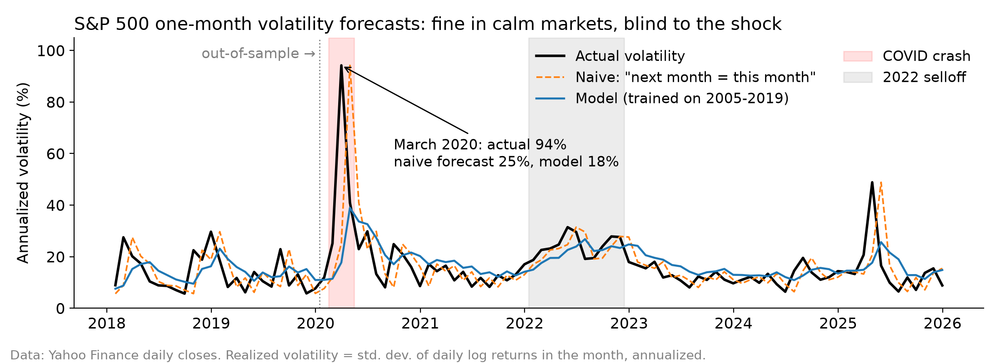

# Do market Models Fail When Confronted with Crisis?

A simple test of Nassim Taleb's argument that forecasting models work in normal times and fail exactly when it matters. I forecast next month's volatility for the S&P 500 and the Magnificent 7, trained a model on 2005–2019 and checked how it held up in calm markets vs. the March 2020 crash and the 2022 selloff. Built with Claude as a coding assistant; the research design, analysis and conclusions are mine.



## Key finding

The model beats a naive "next month = this month" rule in calm markets, out of sample. At the onset of a sudden shock, both forecasts fail. March 2020 is **1.4% of all out-of-sample forecasts but 26% of the model's total squared error**.

| Out-of-sample period | Naive error | Model error | Model closer |
|---|---|---|---|
| Calm months, 2020–25 | 33% | 29% | 56% of months |
| COVID crash, Feb–Apr 2020 | 59% | 50% | 38% of months |
| 2022 selloff | 26% | 22% | 50% of months |

Error = average absolute miss as a share of the actual volatility level, all 8 series pooled.

## Method

- **Data:** daily adjusted closes from Yahoo Finance, 2004–2025: S&P 500 index (^GSPC), AAPL, MSFT, GOOGL, AMZN, NVDA, META, TSLA.
- **Target:** next month's realized volatility = standard deviation of daily log returns within the month × √252.
- **Signals (known at month-end):** log volatility over the last 1, 3 and 12 months; log returns over 1 and 12 months; distance from the 52-week high.
- **Model:** pooled OLS on log volatility, trained on 2005–2019 only (1,248 stock-months, R² = 0.59). Forecasts are converted back from logs with a smearing correction.
- **Benchmark:** naive rule, next month's volatility = this month's.

## How to run

```
python3 -m venv volenv
source volenv/bin/activate
pip install -r requirements.txt
python session1_data_and_benchmark.py   # downloads data, builds volatility, scores the naive rule
python session2_model.py                # trains the model, compares it with naive by period
python session3_chart.py                # makes the chart and the error-concentration figure
```

## Files

| File | What it does |
|---|---|
| `session1_data_and_benchmark.py` | Downloads prices, computes monthly realized volatility, scores the naive benchmark |
| `session2_model.py` | Builds the six signals, fits the regression, compares model vs. naive by period |
| `session3_chart.py` | Produces `volatility_chart.png` and the March 2020 error share |

## Limitations

- Crisis windows were defined with hindsight, and the samples are small.
- Survivorship bias: the Magnificent 7 were chosen because they became winners.
- One set of weights for all 8 series, fitted once and never updated after 2019.
- Standard errors are overstated because the stocks move together in the same month.

## Next steps

- Refit the model every year on an expanding window.
- Add option-implied volatility (VIX) as a forward-looking signal.
- Test on a broader, survivorship-free set of stocks.
